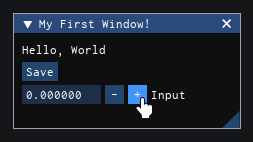

# Iris

Iris is an Immediate mode GUI Library for Roblox, based on Dear ImGui, designed for building the UI for debug / visualisation and content-creation tools.

Iris does this by requiring the developer to only describe what they want and not how they want it to be done, and Iris will handle all of the 'how'. This allows quick iterations from simple and minimal code to produce the tools you need anywhere in your game. Iris makes it faster and more convenient for developers to use a wide range of powerful widgets to build their UI systems. Iris is aimed at the developers who need to quickly check and alter code in development rather than an end UI solution, but how you use it is up to you.

Iris uses an immediate mode UI paradigm, which is different from other conventional UI libraries designed for Roblox. Instead of keeping a reference to every UI element, with Iris you declare the UI you want to appear every frame and it will show you what you asked for. Iris also manages the layout and arrangment of systems whilst also giving control to you making it simple to construct a fully suite of UI debugging tools without worrying about where the UI is going to be positioned.

## Demonstration

With just 8 lines of code, you can create a UI system which works right out of the box:

<div style="width: 100%; display: flex; flex-direction: row; justify-content: center;">
<div style="width:50%; align: center;">

```luau
local StarterPlayerScripts = game.StarterPlayer.StarterPlayerScripts
local Iris = require(StarterPlayerScripts.Client.Iris).Init()

Iris:Connect(function()
    Iris.Window({"My First Window!"})
        Iris.Text({"Hello, World"})
        Iris.Button({"Save"})
        Iris.InputNum({"Input"})
    Iris.End()
end)
```
</div>
<div style="width:50%; align: center; justify-content: center;">
    
</div>
</div>


## Adding to your Game

:::note
This page is not complete yet and will updated.
:::
